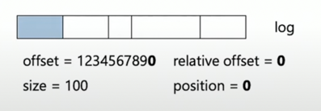
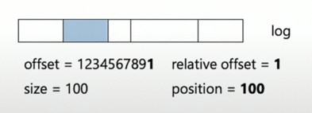

# Apache Kafka
Message broker

## Why Kafka
- data streaming
- many consumers
- multiple scaling (just add more consumers/producers)

### Pros
- high performance
- data persistence
- independent process pipelines
- 'replay history' possibility
- flexibility (because pipeline is simple & consumer/producer could be updated easily with new plugins)

### Cons
- No delayed messages
- No DLQ (holding queue messages that can't be delivered to their destination)
- No TTL for single message
- No priority queue (messages go to the end of partition)

## Architecture 
**Producer** - _publishes_ messages  
**Broker** - responsible for stability, stores messages. Brokers live in **clusters**. Message from producer goes to broker, then goes to consumers _subscribed_ to this broker's **topic**
**Topic** - responsible for correct messages delivery to consumers subscribed to this topic.   
**Consumer** - consumes messages from subscribed topic 

### Broker
One (Single) broker selected as **Controller** in cluster. Controller coordinates cluster work in common: who writes to whom, who and what sees and etc.  
Data distributes between all brokers and segment are not replicated usually.  
`replication factor = N` (where N is replicas number) defines that every partition SHOULD have 2 more replicas. One of N brokers is a **Leader** of each segment, other brokers are **Followers**.  
**ISR (In sync replica)** could help if leader died somehow. In that case one of ISR brokers becomes new leader. When broken broker alive it becomes ISR and gets all missing segments.

### Partition
Topic splits into partitions. Incoming data called **event** can be modified and goes to end of partition. Many events are combined into **segment**. **Segments** numerate from 0 index to +Infinity.  
Data stores in Kafka by segments.  

**Partition** size is limited by setting `retention.bytes = -1`  
How long **segment** live on disk `retention.ms = 604800000`. However older segments could be deleted in out of disk space case.
```
segment = (base_offset, data, index, timeindex)
00000000001234567890.log        <- data storage. New data appends in the end
00000000001234567890.index      <- offset storage, logfile index storage. Helps to search through data
00000000001234567890.timeindex  <- event dates. Also helps with these files naming 
```
**Explanation**  
Base offset  
 
Next event:  


### Pub-Sub with pull read mechanic
1. Consumers subscribes to topic
2. Producers publishes message
3. Consumer **pulls** messages from broker

## .Net Kafka Client
Application <=> .Net Client <=> librdkafka <=> Broker  

### Partitioner mode
Partitioner distributes messages by selected strategy ``:
```csharp
enum Partitioner {
Random,             // equally between all partitions
Consistent,         // same as below but 'key == null' => all messages go to single partition
ConsistentRandom,   // CRC32(Message.Key) -> selects partition on bytes result 
Murmur,             // similar to Consistent, but different algoritm AND compatible to java   
Murmur2
} 
``` 
### How to produce message
```csharp
//..
await producer.ProduceAsync(
    topic,
    new Message<TKey, TValue> {
        Value = value
    },
    () => {} // callback 
);
//..
```
.Net Client decides when to produce messages to broker. 
It depends on `BatchSize = 1000000` and `BatchNumMessages = 10000` or `LingerMs = 5`.  
Example: new messages are coming, but no messages last 5ms - so they pushed in batch to broker.

### Kafka message delivery guarantee
Message consistency depends on selected **Act**:
```csharp
enum Acts : int {
    None = 0,   // no guarantee. Send and forget
    Leader = 1, // wait till leader confirm success
    All = -1    // wait till all brokers confirm success
}
```

### Message compression
Enabled message compression increases CPU usage but helps with traffic.
When?
- Limited disk space
- Low network bandwidth 

## Alternatives
- Rabbit Streams (similar to Kafka, data streaming based)
- Apache Pulsar (inspired by Kafka)
- RocketMQ (alibaba dev)

## Helpful links
- [Kafka: theory to practice](https://youtu.be/ghKnX5fuW5s)