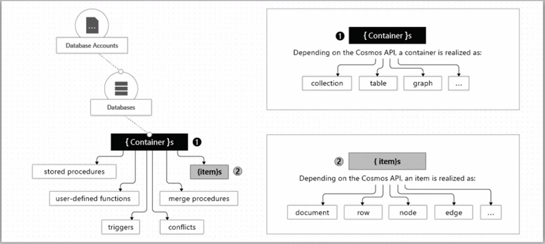

# Azure Cosmos DB
Azure Cosmos DB is a fully managed database service with turnkey global distribution and transparent multi-master replication.  
You can run globally distributed, low-latency operational and analytics workloads and AI on transactional data within your database.  
Data stores in database as JSON documents.  

## Key Features
- Turnover Global Distribution 
  - Transparent multi region distribution
- Regional presence
  - Available in 54+ regions
- Always on
  - 99.99% availability for reads and writes
- Elastic scale
  - 100-1000 mil requests per second
- Low latency guarantee
- No Schema or index management
- Multiple APIs
  - SQL (core API), Cassandra, MongoDB, Gremlin, Azure Table Storage

## CosmosDB Structure

