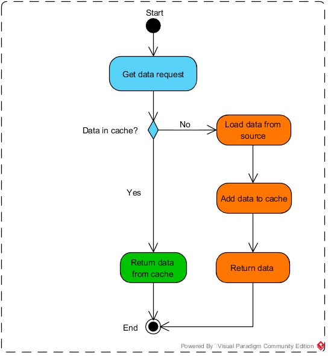

# .NET under the hood

Topic list
Cool
- [Compilation Optimization](#Compilation Optimization)
- [System.Collections.Concurrent](#System.Collections.Concurrent)

Good to know
- [Cache-Aside Pattern](#Cache-Aside Pattern)
- [CQRS pattern](#CQRS pattern)


## Compilation Optimization
The main duty is to MAKE IL CODE, however other tasks are also valuable:
1. Syntax compilation
2. Synthetic sugar
3. Code optimization

### IL (Intermediate Language)
- High level abstraction over assembler (standart ECMA 335)
- Strong typisation
- Struct/Class difference
- Object orientation
- Interface aggregation
- Errors handle through exceptions

### Optimization Goals
- Heavy resource-intensive calls optimization
- Memory use optimization
- Code consistency (consistent developer's rules)
  
### Manual optimizations 
- Common Subexpression Reduction
  - Goes on const/static variables used for calculations to remove them
- Inline
  - Replace method call by code inside of it
- Bound check
  - Cycle precession optimization - removes OutOfArray check
- Tail calling
  - Recursion method optimization - replaces recursion call by iteration call

## System.Collections.Concurrent

### Compare-and-swap loop (CAS loop)
On value change we check for reference of `_head', if actual value is different than saved, then we missed change from another thread.
```
// stack push method in .NET 6
[AtomicOperation] // executes as single operation
public void Push(T item)
{
  Node node = new(T);
  node._next = _head;
  
  while (Interlocked.CompareExchange(ref _head, node, node._next) != node._next)
    node._next = _head;
}
```

### Concurrent collections
- **ConcurrentStack**
  - lock-free
  - fits in very specific cases. 
- **ConcurrentQueue**
  - lock-free
  - allocates a lot of memory (internal segments allocates)
- **ConcurrentDictionary**
  - not lock-free
  - table locks on table length change. It happens on collection grow/collection enumeration.
  - recommended to use in all multithreading cases

## Cache-Aside Pattern
When we need specific data, we first try to get it from the cache. 
If the data is not in the cache, we get it from the source, add it to the cache and return it.  


## CQRS pattern
Problem solves: Read and write workloads are often asymmetrical, with very different performance and scale requirements.  
Principles:
- Commands should be task-based, rather than data centric. ("Book hotel room", not "set ReservationStatus to Reserved").
- Commands may be placed on a queue for asynchronous processing, rather than being processed synchronously.
- Queries never modify the database. A query returns a DTO that does not encapsulate any domain knowledge.

Benefits:
- Independent scaling. CQRS allows the read and write workloads to scale independently, and may result in fewer lock contentions.
- Optimized data schemas. The read side can use a schema that is optimized for queries, while the write side uses a schema that is optimized for updates.
- Security. It's easier to ensure that only the right domain entities are performing writes on the data.
- Separation of concerns. Segregating the read and write sides can result in models that are more maintainable and flexible. Most of the complex business logic goes into the write model. The read model can be relatively simple.
- Simpler queries. By storing a materialized view in the read database, the application can avoid complex joins when querying.