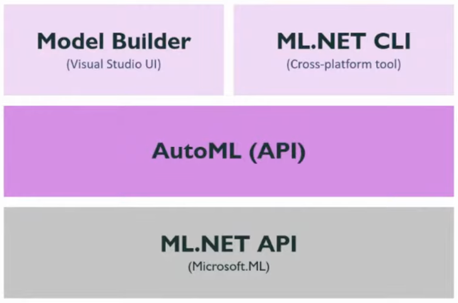
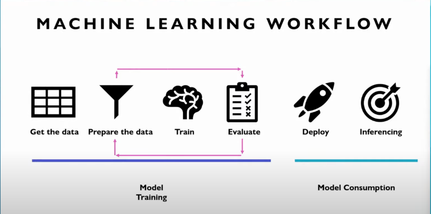

# ML.NET (NOT FINISHED)

Theme is too complicated for my 'code and go' strategy :)  
May be it could be finished after deep learning of ML theory. 

## Goals
- [x] Collect some data from internet to db (HLTV previous csgo matches)
- [x] Build ML model from scrapped data
- [x] Train ML for incoming matches
- [ ] Get predictions above 50% average

## How it works? 
1. Seed matches data for last 6 months to database
2. Use some method with INCOMING MATCH parameters to gain predictions
   1. Collect matches from database for last 6 months (for players from params)
   2. Train machine learning model to find best trainer option
   3. Use trained ML model to get predictions for selected match (from parameters)
3. Get {winrate}% of selected match

## Stack
- ML.NET
- PostgreSQL (docker)
- Dapper ORM
- IAsyncEnumerable
- HtmlAgilityPack

## Theory

## Machine learning workflow

## Problems ML solves 
- Data classification (positive/negative conclusion)
- Image classification (bread/dog/cat on picture)
- Object detection (identifying where are the objects on image)
- Prediction:
    - Regression (prediction of number based on object parameters)
    - Forecasting (prediction based on past sales)
- Suggestion:
    - Recommendation
    - Ranking
- Outliers (anomaly detection)
- Clustering (find relationships between objects)

### How to improve model
- provide more testing data
- filter missing values and outliers
- select different features OR add more features
- choose a different algorithm
- tune algorithm hyperparameters
- cross-validation

## Environment setup
If you need a local database follow instruction below:
Pull&Run PostgreSQL image in docker: `docker run --name postgres-db -e POSTGRES_PASSWORD=admin -p 5432:5432 -d postgres`

## Project setup

## Helpful Links
- [Free datasets for data science](https://www.kaggle.com/)
- [ML.NET GitHub samples](https://github.com/dotnet/machinelearning/blob/main/docs/samples/Microsoft.ML.Samples)
- [QuickStart: ML.NET Model Builder](https://youtu.be/cUqNzZwzUV0)
- [.NET - Machine Learning](https://youtu.be/sBHRd6e5ZBY)
- [RU: ML starter roadmap](https://dou.ua/lenta/columns/study-data-science-and-ml/)
  - [RU: Linear Algebra course](https://youtu.be/CpO7mQZAX7M)
  - [Supervised Machine Learning: Regression and Classification](https://www.coursera.org/learn/machine-learning?action=enroll)