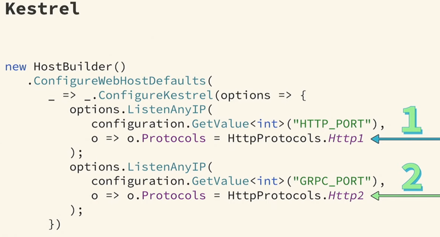
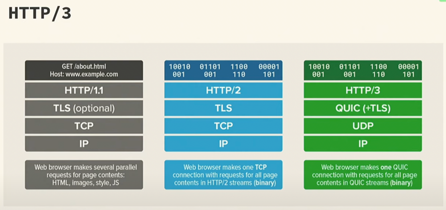

# gRPC project
**!!! Schema first** 

## Goals
- [ ] Create gRPC schema 
- [ ] Make gRPC server
- [ ] Make gRPC client
- [ ] Configure Polly to gRPC
- [ ] Add metrics to gRPC services (anything)

## Project setup
 
## Theory

### Pros
- protobuf contracts
- binary protocol
- HTTP/2 (multiplex)
- streams and bi-directional channel communication
- lot of additional free nugets (metrics, examples, etc)

### HTTP/2
- multiplexing (single connection - multiple requests)
- binary, headers zip
- threads prioritization 
- payload cancel without connection disconnect
- server push 

**Problems with HTTP/2 in .NET:**
1. HTTP/2 with TLS is not supported by Kestrel on MacOS and old Windows OS (win7 and older)
2. HTTP/2 without TLS means consumer has no **handshake** step on connection establishing. Usually **handshake** helps server to understand which HTTP version could consumer understand.   
   So the only way to solve problem - Insecure gRPC servers must be hosted on HTTP/2-only port.  
   First listener configure for HTTP/1 requests. Second listener for HTTP/2 gRPC calls.
   

In .NET 6 HTTP/3 support added.

### Protobuf
Two versions:
- proto2 (support only - deprecated)
- proto3 (actual)

### Channels
Channels works over HTTP connection. Single channel may contain many active connections.  
How channel creates:
1. opens a socket
2. establishing TCP connection
3. negotiating TLS (encrypting can be skipped in local group servers)
4. starting HHTP/2 connection
5. making the gRPC call

## Helpful links
- [gRPC: how we did it](https://youtu.be/y5nLqQPSPBI)